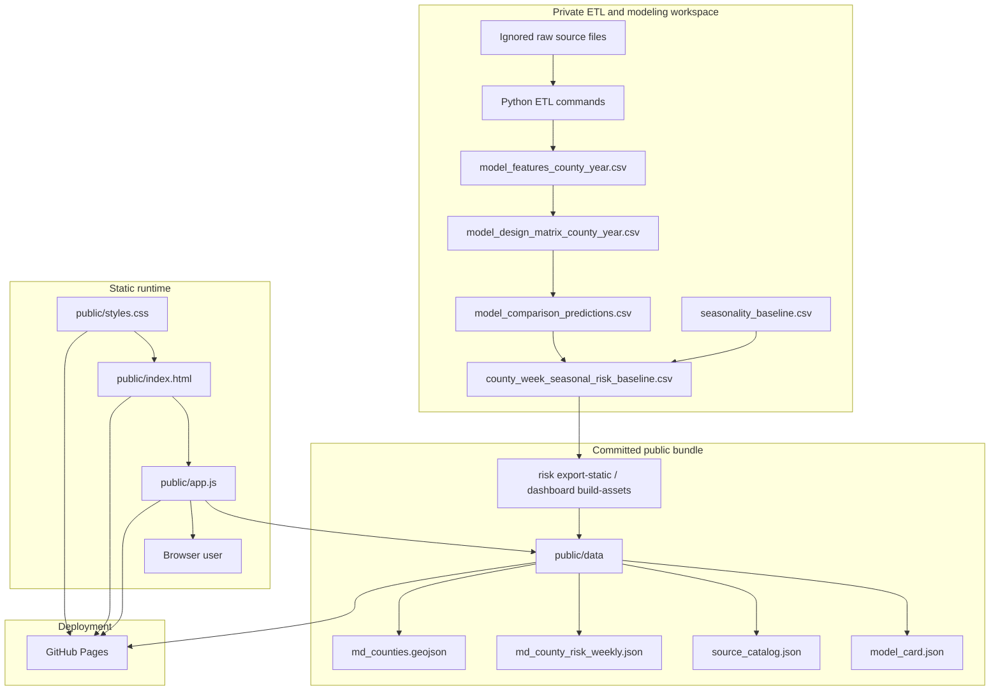
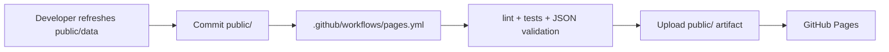

# TickBiteRisk Architecture

> **File location:** `/docs/architecture.md`

---

## Static-first v0 architecture

The implemented v0 product is a static-first Maryland dashboard backed by
derived files. The private ETL/modeling side can use ignored raw files and local
build outputs, but the public runtime reads only committed static assets.



Public v0 properties:

- no raw data in the browser bundle,
- no runtime secrets,
- no database credentials,
- no server-side model execution,
- no live weather or surveillance fetch from the public page,
- one selected model/source/scale branch exported into `public/data`,
- county/date interaction happens in `public/app.js` using static JSON.

## Core data flow

| Stage | Main artifact | Role |
| --- | --- | --- |
| Lyme/weather/ecology ETL | `build/etl/*` | Normalized private build outputs. |
| Feature panel | `model_features_county_year.csv` | Auditable county-year modeling panel. |
| Design matrix | `model_design_matrix_county_year.csv` | Numeric features and target columns for model comparison. |
| Model comparison | `model_comparison_predictions.csv` | Rolling-origin annual predictions across candidate models. |
| Seasonal score | `county_week_seasonal_risk_baseline.csv` | County-week score rows from selected annual predictions and CDC seasonality. |
| Static export | `public/data/*.json` | Public-safe runtime bundle for dashboard and static hosting. |
| Dashboard | `public/app.js` | Loads static JSON, renders map/list/panel, and displays caveats and source lineage. |

## Runtime contracts

The local runtime bridge is:

```bash
tickbiterisk risk lookup --county-fips 24003 --date 2026-05-26 --pretty
```

The static runtime bridge is:

```bash
tickbiterisk risk export-static \
  --scores-path build/etl/county-week-risk/county_week_seasonal_risk_baseline.csv \
  --model-summary-path build/etl/model-comparison/model_comparison_summary.csv \
  --output-dir public/data
```

Both runtime paths must preserve product framing: relative Maryland county-week
Lyme baseline, not diagnosis, treatment guidance, personal infection
probability, or weather-adjusted forecast.

## Deployment architecture

Deployment is intentionally simple:



The workflow deploys committed static files only. It must not require NOAA,
Census, database, or raw-data credentials.

## Future service architecture

A later product version may add a database-backed HTTP service for per-bite or
weather-adjusted risk. That future architecture is separate from v0 and would
need its own implementation plan, validation strategy, security review,
operational runbook, and user-facing wording.

Possible future components include:

- private warehouse for normalized source tables,
- scheduled ETL refresh jobs,
- calibrated model service,
- HTTP API,
- stronger intervention and clinical-safety review.

*Last updated: 2026-05-27*
